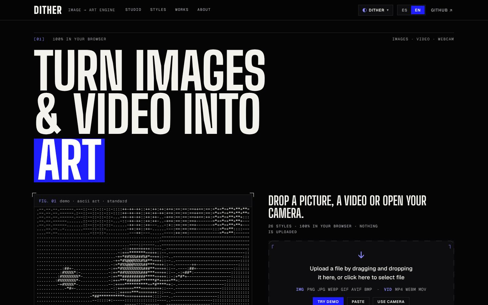
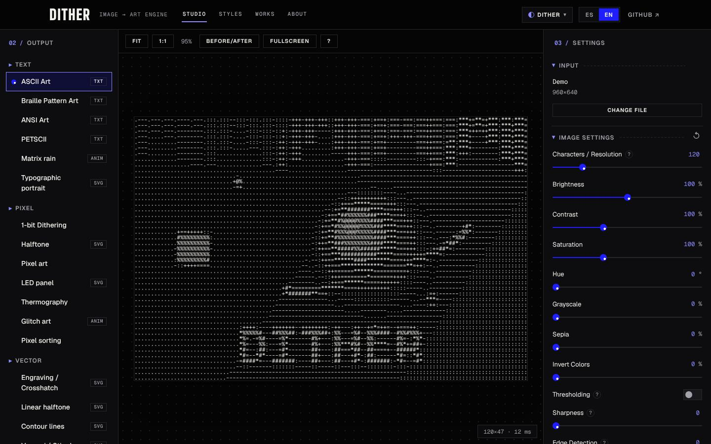
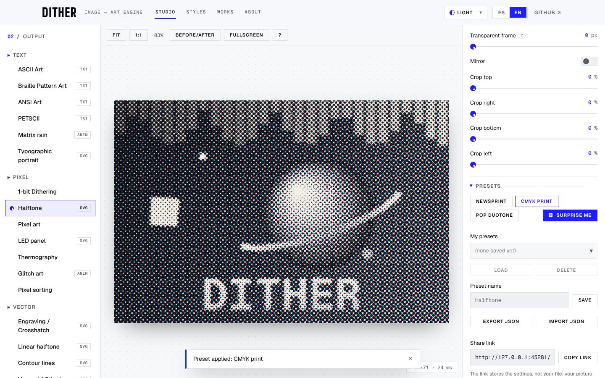
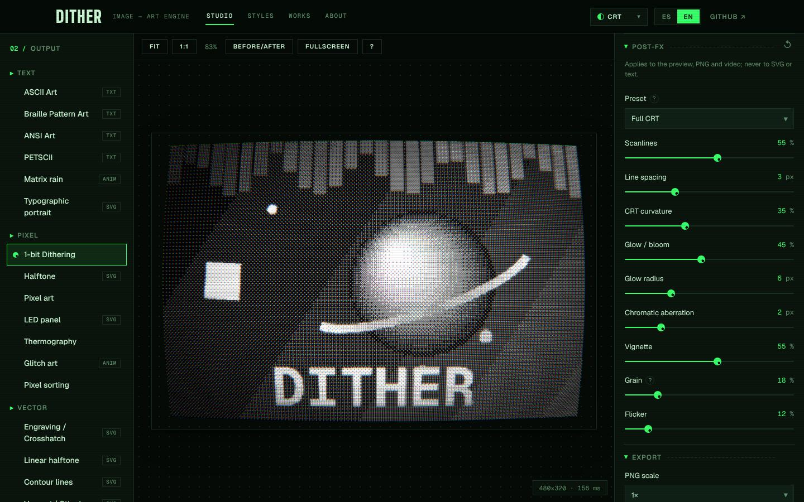
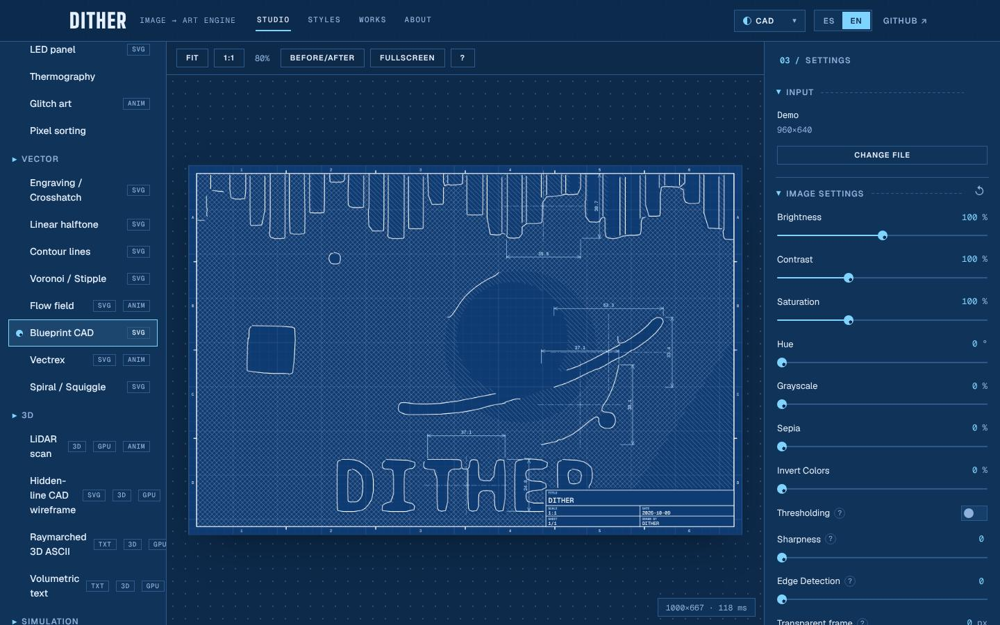
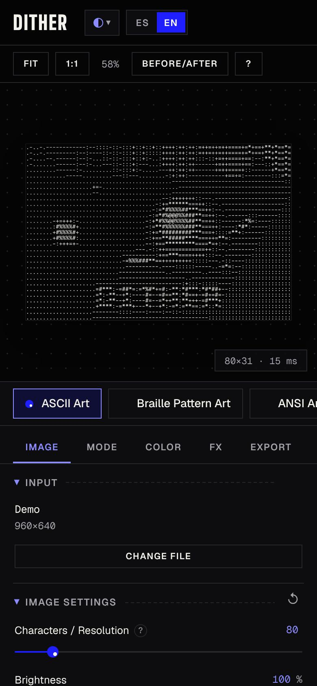

# Dither

*Dither* turns images, video and your webcam into art: ASCII, dithering, Braille, halftone, plotter-ready SVG,
3D, simulations and more, with 26 styles in total. **Everything runs in your browser.** Files are decoded, processed and
exported on your device, and nothing is uploaded.

**Live:** <https://dither.ortzigar.org> · Spec: [`PLAN.md`](PLAN.md) (Spanish) · Agent rules: [`CLAUDE.md`](CLAUDE.md) ·
Publishing: [`DEPLOY.md`](DEPLOY.md)



Its six themes, tokens and components (`css/tokens.css`, `css/components.css`) do not depend on the app's logic.

It is a static site with no framework, no bundler and no build step: plain HTML, CSS, ES modules, WebGL2, Canvas2D and Web
Workers, served as-is by GitHub Pages.

## What it does

| | |
|---|---|
|  |  |
|  |  |

- **26 styles in five families.**
  - **Text:** ASCII, Braille, ANSI art (`.ans` export), PETSCII, Matrix rain and a typographic portrait.
  - **Pixel:** 1-bit dithering (Bayer, blue noise and every error-diffusion kernel), halftone (mono, CMYK, RGB and duotone), pixel art, LED panel, thermography, glitch art and pixel sorting.
  - **Vector:** engraving/crosshatch, contour lines, Voronoi/stipple, flow field, blueprint CAD, Vectrex and a one-line spiral or squiggle.
  - **3D (WebGL2):** LiDAR point cloud, hidden-line CAD wireframe, raymarched 3D ASCII and volumetric text.
  - **Simulation:** Gray-Scott reaction-diffusion and Life-like cellular automata.
- **Inputs:** images (PNG, JPG, WebP, GIF, AVIF and BMP, validated by their magic bytes), video (MP4, WebM and MOV) and the
  webcam. Drop a file anywhere on the page, paste one, or try the demo.
- **Exports:** PNG at 1×, 2× or 4×; SVG (in px or on A4, A3, Letter or a custom page in mm, with Inkscape layers and a plotter
  mode); TXT, HTML and ANSI; PLY and JSON; and MP4 or WebM video with the original sound. You can also copy the result to the clipboard.
- **Post-FX:** scanlines, CRT curvature, glow, chromatic aberration, vignette, grain and flicker, with a *Full CRT* preset.
  They apply to the preview, PNG and video, and never to SVG or text.
- **Presets:** each style has curated presets. You can also save, export and import your own presets as JSON (imports are
  validated and clamped), use *Surprise me* for random settings within each style's ranges, and copy a **share link** that
  carries the settings (never the file).
- **Keyboard:** `[` `]` switch style, `R` resets, `E` exports a PNG, `C` copies, `F` goes fullscreen, `S` shows before/after,
  `X` is *Surprise me*, Space and `←` `→` control video, and `?` lists all the shortcuts.
- **Depth:** by default, brightness stands in for depth. *Enhance with AI* is optional: after you confirm, it downloads Depth
  Anything V2 once and runs it in a worker in your browser.
- **Accessibility:** ES/EN, six themes that meet WCAG AA contrast, and keyboard navigation. It respects
  `prefers-reduced-motion`, and the settings become a bottom sheet with tabs on phones. axe-core reports no violations on the
  home page or in the studio in any of the themes.

<p align="center"></p>

## Run

```bash
python3 -m http.server 8080      # from the repo root
# open http://localhost:8080/
```

All paths are relative, so the same files work under `https://<user>.github.io/<repo>/` and at the root of a custom domain.

## Test

```bash
cd tests
npm install
npx playwright test               # the full suite takes about 20 minutes
```

`@playwright/test` is pinned to 1.56.1 because its Chromium (revision 1194) is the one preinstalled in the development
sandbox, so do not run `playwright install`. The suite serves the repo with `python3 -m http.server` and generates its own
fixtures in `tests/fixtures/`, which is git-ignored. It fails on any console error or CSP violation. `axe-core` is a test-only
dependency and is never shipped.

Generated assets are produced with the app itself:

```bash
node make-icons.mjs          # assets/icons/*.png from assets/icons/dither-icon.svg
node make-og-image.mjs       # assets/og-image.png (1200×630, Open Graph / Twitter card)
node make-screenshots.mjs    # docs/screenshots/*.jpg (this README)
```

## Visit counter

The footer can show an anonymous visit counter. The backend is a Cloudflare Worker with a D1 database in `worker/counter/`.
It stores two numbers and nothing else: no cookies, no IPs and no user agents. The counter stays hidden, and no request is made,
while `counterUrl` in `src/config.js` is empty. To enable it, deploy the Worker as described in `DEPLOY.md` §5, then set
`counterUrl: 'https://count.ortzigar.org'`. A browser counts at most once per day, and never if it sends Global Privacy
Control. If the Worker fails or takes more than 4 s, the counter stays hidden.

## Layout

```
index.html        single page, CSP in a <meta> tag, Open Graph / Twitter metadata
site.webmanifest  installable app manifest (brand icon)
css/              tokens (6 themes), base, layout, components
src/engine/       pipeline, preprocess, dither, color, glyphs, post-FX, depth, WebGL helpers, simulation, geometry…
src/workers/      heavy.worker.js (jobs cancellable by jobId), depth.worker.js (optional AI depth)
src/modes/        one module per output style (interface in PLAN.md 6) + registry
src/ui/           header, dropzone, hero and gallery, controls (generated from schemas), presets, viewer, shortcuts, counter…
src/io/           validation by magic bytes, sources, image/text/SVG/video export
src/i18n/         ES and EN dictionaries
assets/           brand logos (never edited), self-hosted fonts, icons, og-image.png
docs/screenshots/ README screenshots (generated)
vendor/           third-party modules (kept local: no runtime CDN)
worker/counter/   visit counter Worker (deployed separately)
tests/            Playwright suite and asset generators
```

## Adding an output style

Create `src/modes/<id>.js` implementing the interface in PLAN.md section 6: a parameter schema (optionally with
`randomRange` or `random: false` for *Surprise me*), curated `presets`, `resolution()`, `render()`, and optionally
`toText()`, `toSVG()`, `toBinary()`, `toJSON()` and `toPLY()`. Then import it in `src/modes/index.js`. The settings panel,
mode list, gallery card, presets, exports and share link are all generated from that module.

## Privacy

There are no cookies, no analytics and no third-party requests at runtime. The only exceptions are the optional AI depth
model, which loads transformers.js from jsDelivr and the weights from Hugging Face only after you confirm, and the anonymous
visit counter once it is deployed. Your settings and presets are stored in `localStorage`. A share link carries settings in
the URL hash, and the image itself is never stored or sent anywhere.

## Credits

**Algorithms:**
- Dithering: Floyd–Steinberg, Jarvis–Judice–Ninke, Stucki, Atkinson, Burkes and Sierra error diffusion; Bayer ordered dithering; void-and-cluster blue noise (Ulichney).
- Geometry: Sobel, marching squares, Chaikin, Ramer–Douglas–Peucker and Zhang–Suen thinning.
- Voronoi: Lloyd relaxation with d3-delaunay.
- Noise and 3D: simplex and curl noise; SDF raymarching (a homage to donut.c).
- Simulation: Gray-Scott with Karl Sims' Laplacian.
- Depth: Depth Anything V2 through transformers.js.

**Libraries:** video by [Mediabunny](vendor/README.md).

**Fonts (SIL OFL):** Unbounded, Geist, Geist Mono, JetBrains Mono, VT323, IBM Plex Mono and Space Mono.

Made by [ortzigar.org](https://ortzigar.org). Licence: MIT.
